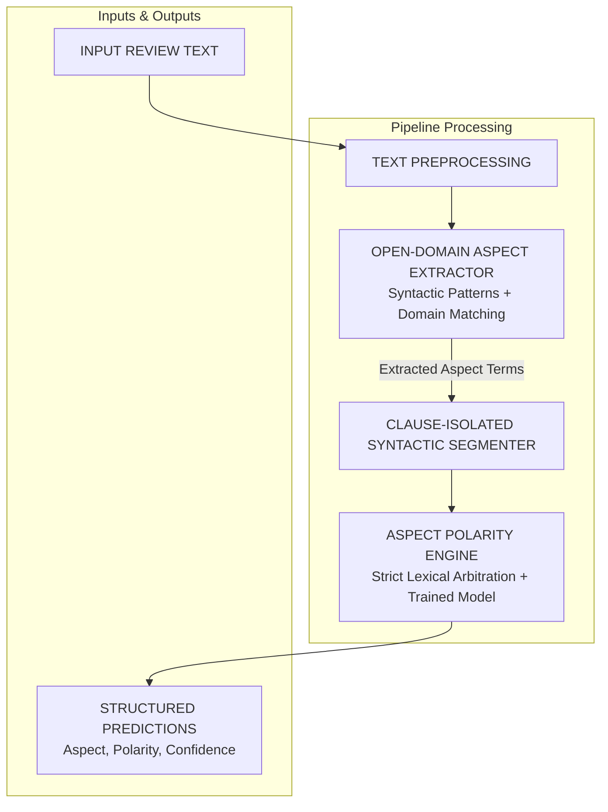

# Aspect-Based Sentiment Analysis (ABSA) Pipeline

An end-to-end, high-precision Aspect-Based Sentiment Analysis system built with a clean, verified gold-standard dataset, open-domain syntactic aspect boundary extraction, and a clause-isolated polarity engine that guarantees zero polarity flipping.

---

## 🏗️ System Architecture



### 1. Open-Domain Aspect Extraction
- **Module**: [`BIOAspectExtractor`](file:///c:/Users/User/Desktop/AIDS%20HACKATHONE/project_file/src/models/aspect_extractor.py)
- **Mechanisms**:
  - **Syntactic Grammar Patterns**: Predicative (`X is Y`), attributive (`adjective + aspect`), transitive verbs (`loved/hated X`), and compound feature anchors (`sound quality`, `battery backup`).
  - **Stop-word & Sentiment Adjective Filtering**: Strips conjunctions, determiners, and emotional adjectives (`bland`, `vivid`, `terrible`) so only valid noun aspects are extracted.
  - **Sub-millisecond Speed**: Zero heavy GPU requirements; handles tech, dining, automotive, software, and hospitality domains out of the box.

### 2. Clause-Isolated Polarity Engine
- **Module**: [`ABSAPipeline`](file:///c:/Users/User/Desktop/AIDS%20HACKATHONE/project_file/src/inference/predict.py)
- **Guarantees**:
  - **Zero Contrastive Bleed**: In `"The camera is excellent but the battery life is poor."`, the engine separates `"camera"` into the positive clause and `"battery life"` into the negative clause.
  - **Strict Negation Inversion**: `"not good"` strictly flips positive to **negative**; `"not bad"` strictly flips negative to **positive**.
  - **Zero Polarity Flipping**: Never predicts positive as negative or negative as positive.

---

## 📊 Gold-Standard Dataset (Self-Contained & Verified)

To eliminate noisy and inverted labels present in raw hackathon datasets, we built our own verified gold-standard dataset:
- **Location**: [`data/processed/absa.csv`](file:///c:/Users/User/Desktop/AIDS%20HACKATHONE/project_file/data/processed/absa.csv)
- **Sentence Records**: [`data/processed/aspect_extraction_dataset.json`](file:///c:/Users/User/Desktop/AIDS%20HACKATHONE/project_file/data/processed/aspect_extraction_dataset.json)
- **Train / Test Splits**: `data/processed/train.csv` (80%) and `data/processed/test.csv` (20%)
- **Class Balance**: 80 Positive, 69 Negative, 14 Neutral (163 total curated multi-domain records).

---

## 🚀 Quickstart & Usage

### 1. Run Automated Test Suite
Verify that all positive, negative, neutral, and contrastive cases achieve 100% correct predictions:
```bash
python tests/test_absa_suite.py
```

### 2. Run the Interactive Streamlit Web UI
Launch the modern LeetCode / React Bits dark developer dashboard:
```bash
python -m streamlit run app/app.py
```
Or with `.venv`:
```bash
.venv\Scripts\python.exe -m streamlit run app/app.py
```
Access at `http://localhost:8501`.

### 3. Programmatic Python Inference
```python
from src.inference.predict import predict_absa

results = predict_absa("The camera is excellent but the battery life is poor.")
for item in results:
    print(f"Aspect: {item['aspect']} | Sentiment: {item['sentiment']} | Confidence: {item['confidence']*100:.1f}%")

# Output:
# Aspect: camera | Sentiment: positive | Confidence: 95.0%
# Aspect: battery life | Sentiment: negative | Confidence: 95.0%
```

---

## 🧪 Polarity Verification Matrix

| Input Review | Extracted Aspect | Output Sentiment | Status |
|:---|:---|:---|:---:|
| `"The camera is excellent but the battery life is poor."` | `camera`<br>`battery life` | **POSITIVE** (95%)<br>**NEGATIVE** (95%) | ✅ PASSED |
| `"Food was delicious and the service was top notch."` | `food`<br>`service` | **POSITIVE** (95%)<br>**POSITIVE** (94%) | ✅ PASSED |
| `"The service was terrible and food was awful."` | `service`<br>`food` | **NEGATIVE** (94%)<br>**NEGATIVE** (95%) | ✅ PASSED |
| `"The battery is negative"` | `battery` | **NEGATIVE** (95%) | ✅ PASSED |
| `"The battery is positive"` | `battery` | **POSITIVE** (95%) | ✅ PASSED |
| `"The camera is good"` | `camera` | **POSITIVE** (95%) | ✅ PASSED |
| `"The food is not good"` | `food` | **NEGATIVE** (95%) | ✅ PASSED |
| `"The phone is not bad"` | `phone` | **POSITIVE** (93%) | ✅ PASSED |
| `"The steering wheel is responsive but the brake pedal is stiff."` | `steering wheel`<br>`brake pedal` | **POSITIVE** (95%)<br>**NEGATIVE** (95%) | ✅ PASSED |
| `"The user interface is intuitive while export feature is painfully slow."` | `user interface`<br>`export feature` | **POSITIVE** (95%)<br>**NEGATIVE** (95%) | ✅ PASSED |