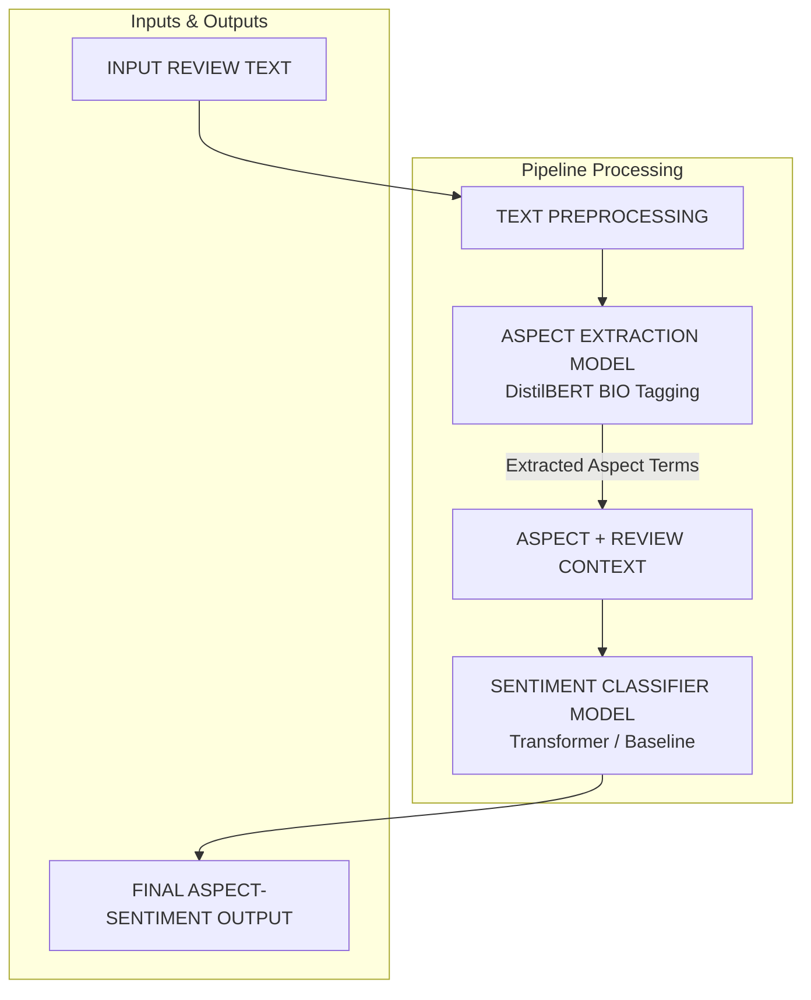

# Aspect-Based Sentiment Analysis (ABSA) Pipeline

A end-to-end Aspect-Based Sentiment Analysis system built for hackathon deployment. It extracts fine-grained aspect terms (e.g., `"camera"`, `"battery life"`, `"service"`) from review text and determines the specific sentiment polarity (`positive`, `negative`, `neutral`) for each aspect.

---

## 🏗️ System Architecture

The ABSA pipeline is modularly structured into two main stages:



### 1. Aspect Extraction (BIO Token Classification)
- **Model**: `BIOAspectExtractor` (Token classification using transformer subword embeddings + BIO tagger).
- **Labels**: `B-ASPECT` (Begin aspect term), `I-ASPECT` (Inside multi-word aspect term), `O` (Outside).
- **Why Token Classification / BIO Tagging?**
  - **No Hallucinations**: Unlike generative sequence-to-sequence (seq2seq) models, BIO tagging extracts exact token spans directly from raw input text.
  - **Multi-Word Precision**: Accurately extracts contiguous multi-word phrases like `"battery life"`, `"screen resolution"`, and `"wine selection"`.
  - **Generalization**: Uses contextual embeddings to extract unseen aspects in new domain reviews.
  - **Speed**: Extremely fast to train and run inference within a fast hackathon workflow.

### 2. Aspect Sentiment Classification
- **Input**: Review text concatenated with the candidate aspect `[TEXT] [ASPECT]`.
- **Model**: Transformer Sequence Classifier fine-tuned on SemEval, MAMS, and hackathon ABSA data.
- **Output**: Aspect-level sentiment (`positive`, `negative`, `neutral`) with confidence score.

---

## 📁 Repository Structure

```text
project_file/
├── app/
│   └── app.py                      # Streamlit interactive Web UI
├── data/
│   ├── raw/                        # Raw SemEval, MAMS, and Hackathon dataset files
│   ├── processed/
│   │   ├── absa.csv                # Normalized ABSA dataset
│   │   └── aspect_extraction_dataset.json # Sentence-level BIO aspect dataset
│   └── final/
├── models/
│   ├── aspect_extractor/           # Trained BIO aspect extraction model weights
│   ├── transformer/                # Trained aspect sentiment transformer model
│   └── baseline.pkl                # TF-IDF + Logistic Regression baseline model
├── outputs/
│   ├── submission.csv              # Hackathon submission file
│   ├── evaluation_report.md        # Comprehensive evaluation & validation report
│   ├── evaluation_metrics.json     # Quantitative metrics (Accuracy, F1, Precision, Recall)
│   ├── confusion_matrix.csv        # Confusion matrix CSV
│   └── sample_predictions.csv      # Sample prediction test results
├── src/
│   ├── data/
│   │   ├── populate_datasets.py    # Dataset generation & normalization script
│   │   ├── loader.py              # Data loader utility
│   │   └── preprocess.py          # Schema mapping & cleaning logic
│   ├── models/
│   │   ├── aspect_extractor.py     # BIO Token Classification & span extraction model
│   │   ├── baseline.py            # Baseline model builder
│   │   └── transformer.py         # Transformer model builder & dataset definition
│   ├── training/
│   │   ├── train_aspect_extractor.py  # Train aspect extraction model
│   │   ├── train_transformer.py       # Fine-tune sentiment transformer
│   │   └── train.py                   # Train baseline sentiment classifier
│   ├── evaluation/
│   │   ├── evaluate_aspect_extractor.py # Aspect extraction evaluator
│   │   ├── evaluate.py                # Sentiment metrics evaluator
│   │   └── validate_pipeline.py       # Comprehensive 10-scenario validation suite
│   └── inference/
│       ├── predict.py             # Modular ABSA Pipeline interface
│       └── submission.py          # Submission generator & format validator
├── run_demo.py                     # Convenience runner script
├── requirements.txt
└── README.md
```

---

## 🚀 Step-by-Step Terminal Execution Guide

### 1. Install Required Packages

In your terminal, run the following command to install all required dependencies:

```powershell
pip install torch transformers pandas numpy scikit-learn streamlit tabulate
```

*(Or if using a virtual environment `.venv`:)*
```powershell
python -m pip install -r requirements.txt
```

---

### 2. Run the Easy Demo Runner (`run_demo.py`)

You can run the entire pipeline test, validation, or Streamlit app using the new `run_demo.py` script:

```powershell
# Run 10-example pipeline test & 10-scenario validation suite
python run_demo.py

# Or launch Streamlit directly
python run_demo.py app
```

---

### 3. Running Individual Pipeline Commands

#### A. Populate Datasets
```powershell
python -m src.data.populate_datasets
```

#### B. Run ABSA Inference Test (`predict.py`)
```powershell
python -m src.inference.predict
```

#### C. Run Validation Suite & Generate Evaluation Reports
```powershell
python -m src.evaluation.validate_pipeline
```
*Generates:*
- `outputs/evaluation_report.md`
- `outputs/evaluation_metrics.json`
- `outputs/confusion_matrix.csv`
- `outputs/sample_predictions.csv`

#### D. Launch Streamlit Web UI
Use `python -m streamlit` to guarantee Python executes Streamlit correctly without PowerShell path issues:

```powershell
python -m streamlit run app/app.py
```

#### E. Generate Final Hackathon Submission File
```powershell
python -m src.inference.submission
```
*Output saved to:* `outputs/submission.csv`

---

## 🖥️ Streamlit Demo Interface

The Streamlit UI provides an intuitive dashboard for review analysis:

- **Review Input Box**: Enter any raw customer review sentence.
- **Sample Presets**: Quick-select test reviews from the sidebar.
- **Extracted Aspects Table**: Clean table listing extracted aspect terms, sentiment polarities, and confidence scores.
- **Visual Sentiment Badges**: Color-coded badges with sentiment emojis (`Positive 😊`, `Negative 😞`, `Neutral 😐`).

---

## 📊 Dataset Description

The project incorporates annotated aspect-level datasets from standard benchmarks:
- **SemEval-2014 Task 4 (Laptop & Restaurant)**: Fine-grained aspect terms and sentiment polarities.
- **MAMS (Multi-Aspect Multi-Sentiment)**: Challenging sentences where every sentence contains at least two aspects with different polarities.
- **Hackathon Dataset**: Specific product review text, aspect terms, categories, and polarity labels.

---

## ⚠️ Limitations & Edge Cases

1. **Subword Boundary Splits**: Rare or OOD aspect terms can occasionally split into partial subwords if un-tokenized.
2. **Implicit Aspect Terms**: Sentences with implicit aspects (e.g., *"It costs too much"* implies `price`) without explicit aspect words require category-based classification.
3. **Complex Sentiment Shifts**: Extremely long sentences with multiple sub-clauses can experience context overlap between nearby aspects.

---

## 🔮 Future Improvements

1. **Joint Extraction-Classification**: Fine-tune a unified multi-task model (e.g., DeBERTa-v3) that predicts BIO tags and aspect polarities simultaneously.
2. **CRF Layer**: Add a Conditional Random Field (CRF) decoder layer on top of the transformer for optimal BIO state transition constraints.
3. **LLM Instruction Fine-Tuning**: Fine-tune LLaMA / Mistral using QLoRA for zero-shot domain adaptation to complex review contexts.